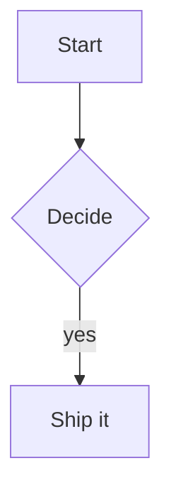
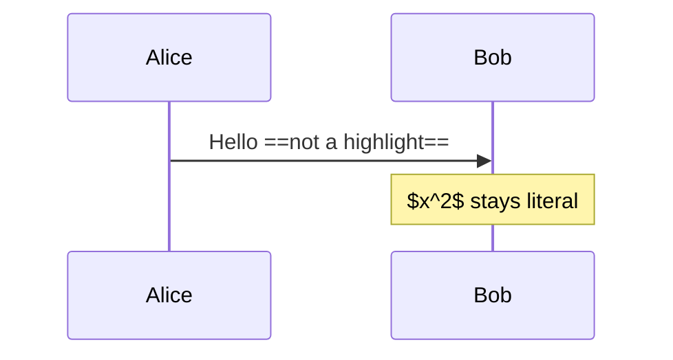

# Diagrams

```mermaid
graph TD
  A[Start] --> B{Decide}
  B -->|yes| C[Ship it]
```

```mermaid
sequenceDiagram
  Alice->>Bob: Hello ==not a highlight==
  Note over Bob: $x^2$ stays literal
```

Text after a diagram, where $x^2$ really is math.
